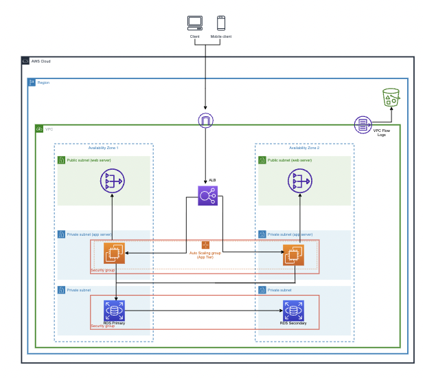

# Terraform Playground
## Intro
This is a simple repo to play with Terraform with a Three tier architecture.  
I'll use AWS as cloud provider.
## Architecture

## Deployment
```bash
$ export MY_TF_ENV=dev     # For dev, set Environment to your first name

# Configure terraform to store your state in S3
$ terraform init -backend-config="bucket=terraform-myname-${MY_TF_ENV}" -backend-config="key=myname/us-east-1/web/main/${MY_TF_ENV}.tfstate"

# Run the plan
$ terraform plan -refresh=true -var-file environments/dev.tfvars -var "state_bucket=terraform-myname-${MY_TF_ENV}" -out ${MY_TF_ENV}.plan

# Apply the plan (Always review the plan first)
$ terraform apply ${MY_TF_ENV}.plan
```